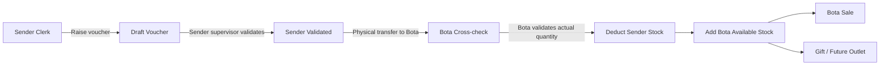

# Bottled Palm Oil Variant Stock Plan

## Scope

Implement Bottled Palm Oil as a special managed product family with size variants, dated prices per variant, two-stage consignments into Bota, Bota-only sales, non-sale outlet movements such as Gift, and monitoring for stock and sales.

Assumptions for implementation:

- The existing `SalesPoint` named `Bota` is the authorized selling point. If exact naming differs, make the value configurable instead of hardcoding the name.
- Bottled Palm Oil sizes are variants under one Product, not separate products.
- Existing kg-based fields remain for current products; Bottled Palm Oil gets variant-aware quantity/stock fields to avoid pretending bottles are kg.

## Data Model

Update [prisma/schema.prisma](prisma/schema.prisma):

- Add `ProductVariant` for Bottled Palm Oil sizes, for example size label, unit, quantity value, active flag, and relation to `Product`.
- Add variant-aware dated pricing, either `ProductVariantPriceSchedule` or an optional `productVariantId` on `ProductUnitPriceSchedule`. Prefer a dedicated `ProductVariantPriceSchedule` to keep existing product pricing untouched.
- Add `StockMovement` / `StockMovementLine` for audited movements:
  - `CONSIGNMENT_OUT`, `CONSIGNMENT_IN`, `SALE`, `GIFT`, and future outlet reasons.
  - source sales point, destination sales point, workflow status such as `DRAFT | SENDER_VALIDATED | BOTA_RECEIVED | VALIDATED | REJECTED`, transaction date, created user, sender validator, and Bota validator.
  - variant id, voucher quantity in units, Bota actual received quantity in units, optional discrepancy note, optional linked batch/source batch.
- Add BPO variant stock support through either a variant-aware batch model or extend `Batch` with nullable `productVariantId` plus generic unit quantities. Keep existing sale allocations compatible with current kg products.

## Pricing Flow

Extend pricing resolution around [lib/pricing/resolve.ts](lib/pricing/resolve.ts):

- Keep current product-level pricing for all existing products.
- Add `resolveVariantUnitPriceExTax(...)` for Bottled Palm Oil variants using the latest effective price on or before the transaction date.
- Update product pricing setup under [app/(app)/setup/product-pricing/ProductPricingClient.tsx](<app/(app)/setup/product-pricing/ProductPricingClient.tsx>) or create a separate Bottled Palm Oil pricing setup page so admins can enter prices per variant and effective date.

## Consignment Flow

Add a new operations screen, for example [app/(app)/stock/bpo-consignments](<app/(app)/stock/bpo-consignments>):

- Non-Bota clerks create a consignment voucher to Bota for selected BPO variants and voucher quantities.
- The sending sales point supervisor validates the voucher, but this does not debit stock yet. At this stage the document is approved for physical transfer only.
- Bota receives the validated voucher, cross-checks it against the actual transferred quantity, records the actual received quantity and any discrepancy, then validates the receipt.
- Only Bota receipt validation posts the stock movement in one transaction: deduct from the sending sales point and add available stock at Bota using the actual validated quantity.
- Bota can view incoming sender-validated vouchers; managers/supervisors validate based on existing permission patterns from [app/(app)/stock/receive/actions.ts](<app/(app)/stock/receive/actions.ts>).

## POS And Movement Rules

Update [app/(app)/pos/actions.ts](<app/(app)/pos/actions.ts>) and related POS UI:

- Allow Bottled Palm Oil variant selection only when the effective sales point is Bota.
- Reject BPO sale attempts from all other sales points with a clear error.
- Use variant pricing for BPO lines; keep existing customer-type/direct product pricing for other products.
- On validation, deduct Bota BPO stock by variant. Existing FEFO logic in [lib/stock-fefo.ts](lib/stock-fefo.ts) remains for kg products and is extended or paralleled for BPO unit stock.
- Add a non-sale movement screen for Bota outbound `Gift` entries, designed so future outlet options can be added as configured movement reasons instead of code changes.

## Reports And Monitoring

Add focused Bottled Palm Oil reporting while preserving current stock/sales reports:

- BPO stock on hand by sales point, Bota variant, and pending consignment status.
- BPO consignment pipeline by status: draft vouchers, sender-validated transfers in transit, Bota discrepancies, and completed movements.
- BPO sales by variant, date/month, customer, and amount.
- BPO outbound by reason, starting with Gift.
- BPO movement audit showing sender voucher quantity, sender supervisor, Bota actual received quantity, Bota validator, discrepancy note, posting date, and final movement quantity.
- Optionally add BPO sections to existing [app/(app)/reports/stock-on-hand/page.tsx](<app/(app)/reports/stock-on-hand/page.tsx>) and [app/(app)/reports/sales/page.tsx](<app/(app)/reports/sales/page.tsx>), but keep a dedicated BPO monitor for clarity.

## Implementation Order

1. Add Prisma models/enums and generate migration/client.
2. Add BPO variant and variant price setup actions/UI.
3. Add consignment voucher workflow: clerk draft, sender supervisor validation with no stock impact, Bota cross-check, and final Bota validation that posts stock.
4. Add POS Bota-only enforcement and variant line support.
5. Add Gift/future outlet movement screen.
6. Add BPO monitoring reports.
7. Test pricing effective dates, transfer validation, Bota-only sales, stock deductions, and report totals.
