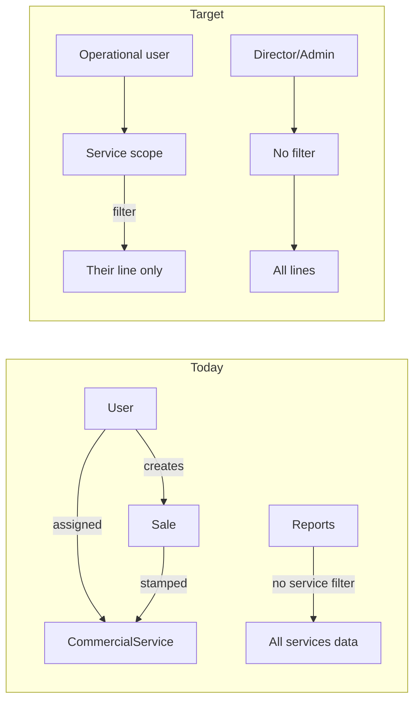

# Commercial service lines: enhanced multi-service model

## What you have today

Your app already has the right **foundation**:

| Piece                                       | Status                                                                                                                                       |
| ------------------------------------------- | -------------------------------------------------------------------------------------------------------------------------------------------- |
| [`CommercialService`](prisma/schema.prisma) | Lines of business (code, name, invoice prefix, letterhead)                                                                                   |
| `User.commercialServiceId`                  | Assignment at user create/edit ([`UsersClient`](<app/(app)/users/UsersClient.tsx>))                                                          |
| Session JWT                                 | `commercialService` on login ([`lib/load-auth-session.ts`](lib/load-auth-session.ts))                                                        |
| **Writes**                                  | New `Sale` / `DeliveryOrder` / BPO outbound stamp `commercialServiceId` via [`resolveCommercialServiceForUserId`](lib/commercial-service.ts) |
| Invoice numbers                             | Per-service sequences (`CommercialInvoiceSequence`)                                                                                          |
| UI shell                                    | Sidebar/footer show assigned line                                                                                                            |

**Gap:** Assignment is mostly **write-time branding**, not **read-time isolation**. Example: sales register filters by sales point and month, not by service ([`app/(app)/reports/sales/page.tsx`](<app/(app)/reports/sales/page.tsx>) lines 82–94). Permissions are **role-only** ([`lib/access-control.ts`](lib/access-control.ts)), not service-aware. A palm-oil clerk can still open reports and operational screens that show rubber data if routes are allowed.

Legacy `User.service` (free text) should be retired in favor of `commercialServiceId` only.



## Recommended pattern: service scope (not full multi-tenant)

Treat each **commercial service** as a **data slice** within one company database—not separate databases or subdomains. This fits CDC-style orgs: one commercial department, multiple product lines, shared customers possible but **operational focus** per line.

### 1. Central service-scope helper (single source of truth)

Add e.g. [`lib/service-scope.ts`](lib/service-scope.ts):

```ts
export type ServiceScope =
  | { mode: "all" } // leadership
  | { mode: "single"; commercialServiceId: string }
  | { mode: "none" }; // logged in but no line assigned — block operations

export function resolveServiceScope(session: AuthSession): ServiceScope;

export function saleWhereForScope(
  scope: ServiceScope,
): Prisma.SaleWhereInput | undefined;

// same for DeliveryOrder, BpoStockMovement, etc.
```

**Rules (per your choice):**

- **All services:** `ADMIN`, `DIRECTOR`, `MANAGER`
- **Single line:** `CLERK`, `SUPERVISOR`, `CLERK_IN_CHARGE_BPO`, etc. — filter every query/mutation by `session.commercialService.id`
- **Unassigned operational user:** cannot post sales/DOs; show setup message (“contact admin to assign a commercial line”)

Optional later: **service switcher** in header for leadership only (stores `activeCommercialServiceId` in session via `unstable_update`) to drill into one line without re-login.

### 2. Enforce on three layers (defense in depth)

| Layer                 | What to do                                                                                                                                                   |
| --------------------- | ------------------------------------------------------------------------------------------------------------------------------------------------------------ |
| **Queries**           | Merge `commercialServiceId` into `where` on all list/report pages and server actions                                                                         |
| **Mutations**         | After `resolveCommercialServiceForUserId`, assert loaded rows’ `commercialServiceId` matches scope on update/delete/print                                    |
| **Routes (optional)** | Hide or disable nav items that are irrelevant per line (e.g. BPO stock only for palm-oil line) via mapping `CommercialService.code` → allowed route prefixes |

You already scope **sales point** for some roles; service scope is the same pattern, orthogonal to sales point.

### 3. Strengthen assignment rules

In [`app/(app)/users/actions.ts`](<app/(app)/users/actions.ts>):

- Require `commercialServiceId` for operational roles (not optional “default fallback” on every write).
- Validate assigned service is **active**.
- On login ([`auth.ts`](auth.ts) / [`load-auth-session.ts`](lib/load-auth-session.ts)): warn or block if operational user has no line.

Remove or hide **Service note** in UI if no longer needed ([`UsersClient`](<app/(app)/users/UsersClient.tsx>)).

### 4. Product and pricing (phase 2 — when lines diverge)

Rubber vs palm oil likely need **different product catalogs** and pricing. Today `Product` appears company-wide. When lines differ materially:

- Add `CommercialServiceProduct` (many-to-many) or `Product.commercialServiceId`, **or**
- Use `ProductCategory` tagged per service

Then filter POS product pickers and pricing reports by scope the same way as sales.

### 5. Reports and dashboards

- Default operational reports: **scoped** to their line.
- Leadership reports: all lines, with optional **filter by service** dropdown (uses `CommercialService` list).
- Crosstabs: add service as row/column dimension where useful.

### 6. UX cues (low cost, high clarity)

- Persistent badge in sidebar: “Palm Oil Sales” / “Rubber” (already partial).
- Tint or label on print headers (already use service snapshots on documents).
- Empty states: “No sales for your service in this period” vs empty company-wide list.

## Phased rollout (practical for this codebase)

### Phase A — Scope helper + critical paths (highest ROI)

1. Implement `lib/service-scope.ts` + unit tests for role → scope mapping.
2. Apply to **POS create/list**, **delivery orders**, **sales register**, **dashboard** aggregates.
3. Add `assertRecordInScope(record, scope)` for get-by-id actions (invoice print, edit).

Files likely touched: [`app/(app)/pos/actions.ts`](<app/(app)/pos/actions.ts>), [`app/(app)/delivery-orders/actions.ts`](<app/(app)/delivery-orders/actions.ts>), report pages under `app/(app)/reports/`, shared report helpers.

### Phase B — Assignment hardening

- Mandatory `commercialServiceId` for operational roles; login guard; deprecate `User.service`.

### Phase C — Catalog and nav per service

- Product/pricing linkage; optional route allowlist per `CommercialService.code` (e.g. `bpo` → BPO routes only).

### Phase D — Leadership tools (optional)

- Service filter on reports; optional context switcher for directors.

## What not to do (unless you outgrow single DB)

- Separate Next.js apps per service — unnecessary operational overhead.
- Subdomain per service — only if legal/IT requires hard isolation.
- Relying only on UI hiding — users can still hit APIs; **server scope is mandatory**.

## Success criteria

- Palm-oil clerk: sales register, POS, and DO lists show **only** palm-oil `commercialServiceId` rows.
- Rubber clerk: same for rubber.
- Director/admin: same screens show **all** lines; can filter by service in reports.
- Direct URL to another line’s invoice ID returns **403** for scoped users.
- New documents always stamp the creator’s resolved service (already true; keep).

## Summary

Your current model is **“assign user → stamp documents.”** The enhanced model is **“assign user → enforce service scope on every read/write.”** That is the standard pattern for multi-line sales ops inside one ERP/POS: **session service context + query filters + mutation checks**, with leadership exempt from the filter.

Recommended next implementation step: **Phase A** (`lib/service-scope.ts` + apply to POS, delivery orders, and sales register).
