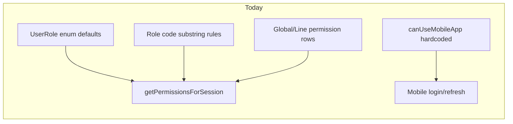
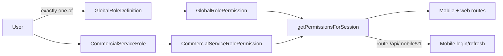

# DB-driven role permissions and Setup UI

## Problem

Today, capabilities are computed three ways:

1. **Enum defaults** — [`defaultPermissionsForRole`](lib/access-control.ts) + legacy [`RolePermission`](prisma/schema.prisma) rows keyed by `UserRole`
2. **Code substring heuristics** — [`defaultPermissionsForServiceRoleCode`](lib/access-control.ts) (`code.includes("supervisor")`, etc.)
3. **Partial DB** — [`GlobalRolePermission`](prisma/schema.prisma) / [`CommercialServiceRolePermission`](prisma/schema.prisma) (already edited in [Setup → Permissions](<app/(app)/setup/permissions/page.tsx>))

Mobile is a clear example of the mismatch: login uses [`canUseMobileApp`](lib/mobile/access.ts) (enum + string rules) while the API already has permission key `route:/api/mobile/v1` in [`PERMISSION_KEYS`](lib/access-control-keys.ts).



## Target architecture



- **`User.role` enum stays** for workflow mapping only ([`userRoleFromLineRoleCode`](lib/line-role-user-role.ts), validation rules) — not as the permissions source.
- **Every active user** must have `globalRoleDefinitionId` **or** `commercialServiceRoleId` (mutually exclusive, as today in [users actions](<app/(app)/users/actions.ts>)).
- **Runtime** reads permissions only from DB rows; no `getPermissionsForRole(session.role)` fallback.

## What already exists (reuse)

| Piece                  | Location                                                                                                                                  |
| ---------------------- | ----------------------------------------------------------------------------------------------------------------------------------------- |
| Permission keys        | [`lib/access-control-keys.ts`](lib/access-control-keys.ts)                                                                                |
| DB tables + lazy seed  | [`getPermissionsForGlobalRoleDefinition`](lib/access-control.ts), [`getPermissionsForServiceRole`](lib/access-control.ts)                 |
| Full matrix UI         | [`PermissionsClient.tsx`](<app/(app)/setup/permissions/PermissionsClient.tsx>) + [`actions.ts`](<app/(app)/setup/permissions/actions.ts>) |
| Mobile API enforcement | [`withMobileAuth`](lib/api/mobile/with-mobile-auth.ts) per-route keys                                                                     |

## 1. New Setup route: Role access

Add **`/setup/role-access`** (name can be “Role access” in nav under Setup).

**Purpose:** Business-friendly configuration without scrolling the full permission matrix — grouped toggles that write the same DB keys as Permissions.

**UI (admin-only, same guard as permissions):**

- **Global roles** table: each `GlobalRoleDefinition` (Admin, Director, custom) with capability groups:
  - Mobile monitoring → `route:/api/mobile/v1`
  - Operations → POS / DO / stock routes + related `ui:*` keys
  - Reports → `route:/reports/*` keys (respect commercial module filter for line roles)
  - Setup / admin → setup routes + `ui:manage-access-control`
  - Leadership → executive dashboard, DO validation, stock reclassify, etc.
- **Line roles** section: pick commercial line → list `CommercialServiceRole` with same groups (module-filtered routes for that line’s `enabledModules`).
- Link: “Edit all permission keys” → existing `/setup/permissions`.

**Server:** New [`app/(app)/setup/role-access/actions.ts`](<app/(app)/setup/role-access/actions.ts>) reusing `setGlobalRolePermission` / `setServiceRolePermission` (or shared helpers) to upsert multiple keys per group toggle.

**Access control:** Add `route:/setup/role-access` to [`PERMISSION_KEYS`](lib/access-control-keys.ts), [`lib/commercial-modules.ts`](lib/commercial-modules.ts) setup module, [`app/(app)/layout.tsx`](<app/(app)/layout.tsx>) nav; grant to admin global role via migration.

## 2. Runtime: permissions from DB only

### [`lib/access-control.ts`](lib/access-control.ts)

- **`getPermissionsForSession`:** Require `session.globalRole` or `session.commercialServiceRole`; remove fallback to `getPermissionsForRole(session.role)`. If missing, return all-deny map and log (or throw in dev) so misconfigured users are visible.
- **Stop using at runtime** (keep only for one-time migration script/SQL):
  - `defaultPermissionsForRole`
  - `defaultPermissionsForServiceRoleCode` substring logic
  - `defaultPermissionsForGlobalRoleCode` → `legacyRole` branch that delegates to enum
  - `grantMobileApiAccess`
- **`getPermissionsForGlobalRoleDefinition` / `getPermissionsForServiceRole`:** When no DB rows exist, seed from a **static snapshot** in [`lib/permission-seed-snapshot.ts`](lib/permission-seed-snapshot.ts) (generated once from current code defaults during implementation), not from live enum/heuristic functions.
- **`reset*Permissions` actions:** Reset to snapshot for that role type, not enum functions.

### [`lib/mobile/access.ts`](lib/mobile/access.ts)

- Replace `MOBILE_LEGACY_ROLES` / code `includes()` checks with async check:

```ts
const perms = await getPermissionsForSession(session);
return perms["route:/api/mobile/v1"] === true;
```

- Update [`authenticateMobileUser`](lib/mobile/auth-service.ts) and [`refreshMobileTokens`](lib/mobile/auth-service.ts) to await this.

### Mobile `/me` route

- Change [`app/api/mobile/v1/me/route.ts`](app/api/mobile/v1/me/route.ts) gate from `route:/dashboard` to `route:/api/mobile/v1` so sign-in permission matches API access.

## 3. User assignment enforcement

### [`app/(app)/users/actions.ts`](<app/(app)/users/actions.ts>)

- On create/update: reject users with neither `globalRoleDefinitionId` nor `commercialServiceRoleId` (and reject both set).
- Stop relying on enum-only users for permissions.

### Data migration (SQL)

One migration (e.g. `20260601120000_permissions_db_only`):

1. **Backfill role definitions on users** where null:
   - Map `User.role` + `commercialServiceId` → appropriate `CommercialServiceRole` (match code: clerk, supervisor, …) or `GlobalRoleDefinition` (admin/director via `legacyRole`).
2. **Backfill permission rows** for every `GlobalRoleDefinition` and `CommercialServiceRole` using current effective defaults (same outcome as today’s enum + heuristics + existing rows). Use `INSERT … ON CONFLICT` on unique `(roleId, key)`.
3. **Enable mobile** on roles that currently pass `canUseMobileApp` (supervisor/manager/director/admin line + global).
4. **Grant** `route:/setup/role-access` to admin global role.

Optional follow-up (not blocking): stop writing to `RolePermission` table; leave table in schema until a later drop migration.

## 4. New role creation (no code heuristics)

### [`ensureDefaultServiceRolesForCommercialService`](lib/load-auth-session.ts)

After creating default line roles, **insert** `CommercialServiceRolePermission` rows from snapshot templates (`clerk`, `supervisor`, `senior_supervisor`, `manager`, factory variants) — do not rely on lazy `getPermissionsForServiceRole` + `defaultPermissionsForServiceRoleCode`.

### [`saveCommercialServiceRole`](<app/(app)/setup/permissions/actions.ts>)

- On **create**: offer preset (clone existing line role or named template from snapshot); default preset = minimal safe set (dashboard + line module routes disabled except essentials), **not** `defaultPermissionsForServiceRoleCode(created.code)`.
- On **edit**: permissions unchanged unless admin resets via Setup.

### New global roles

- [`saveGlobalRoleDefinition`](<app/(app)/setup/permissions/actions.ts>): seed permissions from “custom global” snapshot (dashboard + reports), not `defaultPermissionsForGlobalRoleCode`.

## 5. Deprecate enum permission API

Remove or gate behind admin-only dev tools:

- `setRolePermission`, `resetRolePermissions`, `getRolePermissionsAction` in [permissions actions](<app/(app)/setup/permissions/actions.ts>)
- Any UI that edits `RolePermission` by `UserRole` (if present)

Document in code comment on `RolePermission` model: deprecated, unused at runtime.

## 6. Labels and docs

- Add human labels in [`permissionLabelForKey`](lib/access-control-keys.ts) for `route:/api/mobile/v1` and `route:/setup/role-access`.
- Update [`mobile/README.md`](mobile/README.md): mobile access is configured under Setup → Role access (permission key), not by enum.

## 7. Verification

- Admin toggles mobile off for a supervisor line role → login fails with existing message; refresh revokes token.
- Clerk line role → no mobile login; POS still works via line permissions.
- Custom new line role code (e.g. `warehouse_lead`) → permissions only what Setup assigns; no automatic supervisor/mobile grants.
- Run `npm run build` / smoke: web layout guard, mobile login, one report + validation endpoint.

## Out of scope (follow-up)

- Removing `UserRole` from Prisma entirely (still needed for workflow).
- Dropping `RolePermission` table physically.
- Replacing [`userRoleFromLineRoleCode`](lib/line-role-user-role.ts) with DB flags on line roles (separate “capabilities” model).

## Risk / mitigation

| Risk                                     | Mitigation                                                                    |
| ---------------------------------------- | ----------------------------------------------------------------------------- |
| Users lose access after deploy           | Migration backfills assignments + permissions before code stops enum fallback |
| New roles start with too few permissions | Presets + clone-from-role on create; admin uses Role access + Permissions     |
| Performance (extra DB read on login)     | Already loads permissions on login; cache not required initially              |
