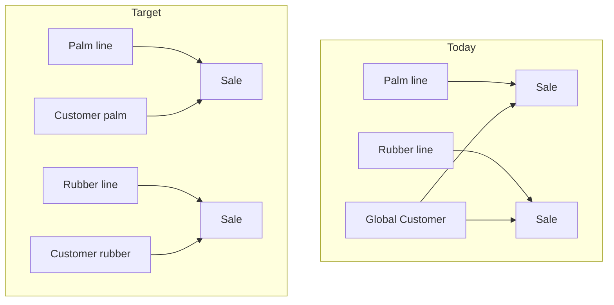

# Line-scoped customer management

## Problem today

Customers are **company-wide** with **palm-oil tax semantics** baked into one row:

```374:394:prisma/schema.prisma
model Customer {
  ...
  customerType  CustomerType      @default(INDUSTRY)
  residency     CustomerResidency @default(LOCAL)
  taxRegimeId   String
  ...
  // no commercialServiceId
}
```

Tax resolution in [`lib/tax/resolve-customer.ts`](lib/tax/resolve-customer.ts) encodes palm rules (e.g. skip Sales Tax for `INDUSTRY`, VAT only for `LOCAL`). Every line’s POS/DO loads the **same** customer list ([`app/(app)/pos/page.tsx`](<app/(app)/pos/page.tsx>), [`app/(app)/delivery-orders/page.tsx`](<app/(app)/delivery-orders/page.tsx>)). Operational users on rubber vs palm share one master file, which does not match separate buyers per line or different tax treatment per service.

This conflicts with the existing multi-line model where **transactions** are already stamped with `commercialServiceId` ([`lib/commercial-service.ts`](lib/commercial-service.ts), [`lib/service-scope.ts`](lib/service-scope.ts)).



## Recommended approach (per your choice: separate records per line)

### 1. Schema: bind `Customer` to a commercial line

Add to [`prisma/schema.prisma`](prisma/schema.prisma):

- `Customer.commercialServiceId String` (required, FK → `CommercialService`, `onDelete: Restrict`)
- `@@index([commercialServiceId])`
- Optional: `@@unique([commercialServiceId, name])` if duplicate names across lines are allowed but not within a line (confirm with business; otherwise index only)

**Migration strategy**

- Backfill existing rows to the **default / palm-oil** `CommercialService` (same pattern as product backfill in isolation work).
- Fail migration if no default line exists (seed first).

**Tax regimes (phase 1b — recommended with line customers)**

- Add optional `TaxRegime.commercialServiceId` (nullable = legacy shared; non-null = line-specific catalog).
- UI at [`app/(app)/tax-regimes`](<app/(app)/tax-regimes>): leadership sees all; operational users only regimes for their line (or shared + their line).
- Customer form only offers regimes valid for the selected line.

Keeps palm SAT/VAT regimes separate from future rubber regimes without forking `resolveTaxesForCustomer` yet.

### 2. Service scope for customers

Extend [`lib/service-scope.ts`](lib/service-scope.ts):

```ts
export function customerWhereForScope(
  scope: ServiceScope,
): Prisma.CustomerWhereInput | undefined;
```

| Scope    | Behavior                             |
| -------- | ------------------------------------ |
| `all`    | No filter (leadership)               |
| `single` | `commercialServiceId = session line` |
| `none`   | Block customer CRUD / pickers        |

Mirror [`saleWhereForScope`](lib/service-scope.ts) usage.

### 3. Customer CRUD and UI

**[`app/(app)/customers/page.tsx`](<app/(app)/customers/page.tsx>)**

- Resolve session scope server-side; pass `commercialServiceId` (or scope mode) to client.
- Filter `customer.findMany` with `customerWhereForScope`.
- Load tax regimes filtered by line (when `TaxRegime.commercialServiceId` exists).

**[`app/(app)/customers/actions.ts`](<app/(app)/customers/actions.ts>)**

- On create: set `commercialServiceId` from `resolveCommercialServiceForUserId` (not from client).
- On update/delete: `assertRecordInScope` on loaded customer (same pattern as POS/DO mutations).
- Validate `taxRegimeId` belongs to same line (or shared regime).

**[`app/(app)/customers/CustomersClient.tsx`](<app/(app)/customers/CustomersClient.tsx>)** (already modal/table style)

- Show **Line** column for leadership; hide or fix line for single-scope users.
- Add line badge in modal title when leadership creates for a chosen line (dropdown) or auto-assign for clerks.
- Empty state: “No customers for [line name]”.

### 4. Downstream pickers (critical path)

Apply `customerWhereForScope` everywhere customers are listed:

| Consumer        | File                                                                                                                                                            |
| --------------- | --------------------------------------------------------------------------------------------------------------------------------------------------------------- |
| POS             | [`app/(app)/pos/page.tsx`](<app/(app)/pos/page.tsx>), [`app/(app)/pos/actions.ts`](<app/(app)/pos/actions.ts>) (validate customer on post)                      |
| Delivery orders | [`app/(app)/delivery-orders/page.tsx`](<app/(app)/delivery-orders/page.tsx>), actions                                                                           |
| Reports         | [`app/(app)/reports/customer-delivery-monitor`](<app/(app)/reports>) — filter by line, not only sales point                                                     |
| BPO             | [`app/(app)/stock/bpo-outbound/actions.ts`](<app/(app)/stock/bpo-outbound/actions.ts>) — `ensureBpoSaleCustomer` must set `commercialServiceId` on created rows |

**Posting guard:** when creating `Sale` / `DeliveryOrder`, assert `customer.commercialServiceId === sale.commercialServiceId` (or null legacy during transition). Prevents palm customer on rubber invoice.

### 5. Tax logic (keep resolver; narrow palm assumptions)

[`lib/tax/resolve-customer.ts`](lib/tax/resolve-customer.ts) stays the single resolver; line-specific behavior comes from **which regime/types are on that line’s customer record**.

Short-term:

- Document that SAT/INDUSTRY rules are **palm-oriented**; rubber customers use regimes without SAT or different `customerType` defaults.
- Optional follow-up: `resolveTaxesForCustomer(prisma, customerId, soldAt, { commercialServiceId })` to load customer **and** assert line match.

Medium-term (out of scope unless needed immediately):

- Pluggable tax rules per `CommercialService.code` (e.g. `palm-oil-sales` vs `rubber`).

### 6. Customer type and form fields (palm vs rubber)

`CustomerType` (`INDUSTRY`, `WHOLE_SALE`, `RETAIL`, `WORKER`) is palm/BPO-centric and drives pricing ([`lib/pricing`](lib/pricing)) and SAT exemption.

**Phase 1:** Keep enum; rubber line uses sensible defaults (`RETAIL` / new default per line in seed).

**Phase 2 (optional):** `CommercialService.customerTypeOptions` JSON or small lookup table so each line’s customer form shows only relevant types (rubber factory buyers vs palm industry/wholesale).

### 7. Data migration and compatibility

1. Add `commercialServiceId` nullable → backfill → set NOT NULL.
2. Assign existing customers to default palm line.
3. Re-link BPO synthetic customers to BPO’s `commercialServiceId`.
4. Leadership can duplicate a buyer on another line manually (separate records by design).

No change to **sale snapshots** (`taxRegimeId` on `Sale` remains audit trail).

## Phased rollout

| Phase | Deliverable                                                              |
| ----- | ------------------------------------------------------------------------ |
| **A** | Schema + migration + `customerWhereForScope` + scoped `/customers` CRUD  |
| **B** | Scoped POS/DO pickers + mutation assert customer line = document line    |
| **C** | Line-scoped tax regimes (optional column + filtered setup UI)            |
| **D** | Reports + BPO customer helpers; per-line customer type config (optional) |

## Success criteria

- Palm clerk: customer list and POS picker show **only palm-line** customers.
- Rubber clerk: same for rubber; cannot select palm customers.
- Director: sees all lines; can create customers per line.
- Posting palm sale with rubber `customerId` → server error.
- Existing customers remain usable on palm line after migration.
- Tax preview on POS/DO unchanged in API shape; rates follow each line’s customer + regime.

## Out of scope (follow-ups)

- Merging duplicate customers across lines (you chose separate records).
- Full rubber-specific tax rule engine (until rubber regimes and types are defined).
- Customer soft-delete / “in use on another line” (separate records reduce need).

## Key files to change

- [`prisma/schema.prisma`](prisma/schema.prisma) + new migration
- [`lib/service-scope.ts`](lib/service-scope.ts)
- [`app/(app)/customers/page.tsx`](<app/(app)/customers/page.tsx>), [`actions.ts`](<app/(app)/customers/actions.ts>), [`CustomersClient.tsx`](<app/(app)/customers/CustomersClient.tsx>)
- [`app/(app)/pos/page.tsx`](<app/(app)/pos/page.tsx>), [`app/(app)/pos/actions.ts`](<app/(app)/pos/actions.ts>)
- [`app/(app)/delivery-orders/page.tsx`](<app/(app)/delivery-orders/page.tsx>), delivery-order actions
- [`app/(app)/stock/bpo-outbound/actions.ts`](<app/(app)/stock/bpo-outbound/actions.ts>)
- Optionally [`app/(app)/tax-regimes/*`](<app/(app)/tax-regimes>) for line-scoped regimes
