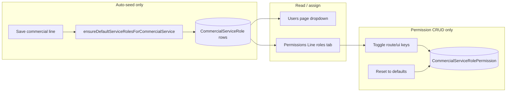

# Line role CRUD — current state

## Short answer

**No full CRUD UI for line roles.** You can manage **permissions** for existing line roles and **assign** them to users, but you cannot add, rename, or delete line role records through the app.

---

## What exists today

| Operation  | Line role record (`CommercialServiceRole`)                                                                                                    | Line role permissions (`CommercialServiceRolePermission`)                                                            |
| ---------- | --------------------------------------------------------------------------------------------------------------------------------------------- | -------------------------------------------------------------------------------------------------------------------- |
| **Create** | Auto-only when a line has zero roles ([`lib/load-auth-session.ts`](lib/load-auth-session.ts) `ensureDefaultServiceRolesForCommercialService`) | Implicit on first load via `getPermissionsForServiceRole` seeding ([`lib/access-control.ts`](lib/access-control.ts)) |
| **Read**   | Listed on [Users](<app/(app)/users/page.tsx>) and [Permissions](<app/(app)/setup/permissions/page.tsx>)                                       | Line roles tab in [`PermissionsClient.tsx`](<app/(app)/setup/permissions/PermissionsClient.tsx>)                     |
| **Update** | Not in UI (code/name/sortOrder/isActive)                                                                                                      | Yes — toggle checkboxes + `setServiceRolePermission` in [`actions.ts`](<app/(app)/setup/permissions/actions.ts>)     |
| **Delete** | Not in UI                                                                                                                                     | Not in UI (only full reset of all keys for a role)                                                                   |

### Default roles (seeded once per line)

- **Sales point lines:** Sales clerk, Supervisor, BPO clerk in charge
- **Factory lines:** Factory clerk, Factory supervisor, Factory manager

Triggered when saving a line in [commercial-services/actions.ts](<app/(app)/setup/commercial-services/actions.ts>) if that line has no roles yet.

### Where admins interact today

1. **Setup → User Access control → Line roles** — pick commercial line + line role, edit **permission matrix** (not the role name/code).
2. **Users** — assign an existing line role to an operational user.
3. **Setup → Services** — saving a line may seed default roles; no role list editor on that page.

---

## What is missing for full line-role CRUD

To manage role **definitions** (not just permissions), you would need something like:

- New section under **Setup → Services** (per line) or **Setup → Permissions** (line roles tab extended)
- Server actions: `createCommercialServiceRole`, `updateCommercialServiceRole`, `deactivateCommercialServiceRole` (soft-delete via `isActive`)
- Guards: block delete/deactivate if users are assigned; unique `(commercialServiceId, code)`
- Optional: re-seed button or “Add role” with custom `code` + `name`

Estimated touchpoints:

- [`app/(app)/setup/permissions/`](<app/(app)/setup/permissions/>) or [`app/(app)/setup/commercial-services/`](<app/(app)/setup/commercial-services/>)
- New actions file or extend [`permissions/actions.ts`](<app/(app)/setup/permissions/actions.ts>)
- [`prisma/schema.prisma`](prisma/schema.prisma) — model already has `code`, `name`, `sortOrder`, `isActive` (no schema change required)

---

## Recommendation

If the goal is only to **tune access** for palm vs rubber staff, the current **Line roles** permissions tab is sufficient.

If you need **custom role titles** per line (e.g. “Weighbridge operator”) without DB edits, add a **line role definitions** UI as a follow-up task.
