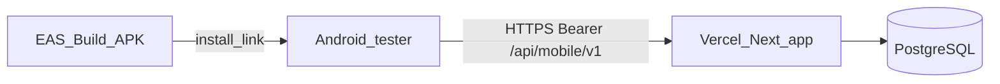

# Internal mobile distribution — Android only (Vercel API + EAS Build)

## Scope

**In scope now:** Android internal testers (APK via EAS Build install link).

**Deferred:** iOS / TestFlight (requires Apple Developer Program and separate build/submit flow). Add when you need iPhone testers.

## Context

Your backend is already suitable for remote testers:

- Mobile API lives on the **same Next.js app** as the web UI: `/api/mobile/v1/*` ([`proxy.ts`](proxy.ts) skips cookie auth for these routes; handlers use Bearer tokens).
- The Expo app in [`mobile/`](mobile/) calls that API via [`mobile/src/api/client.ts`](mobile/src/api/client.ts).
- **Dev workflow today** (Expo Go + LAN IP in `.env`) only works when a PC runs `npm run dev` — not what you want for testers hitting **Vercel**.

For release builds, the app must bake in your Vercel URL:



Priority for `getApiBaseUrl()` in [`mobile/src/api/client.ts`](mobile/src/api/client.ts):

1. `app.json` → `expo.extra.apiBaseUrl`
2. `EXPO_PUBLIC_API_BASE_URL` (set at **EAS build** time)
3. Dev-only LAN auto-detect

In a release build (`__DEV__ === false`), if neither (1) nor (2) is set, login fails with **"API base URL is not configured."** — configuring the Vercel URL in EAS is mandatory.

---

## Recommended approach: EAS Build — Android internal APK

| Option | Best for | Hits Vercel without your laptop? |
|--------|----------|----------------------------------|
| **Expo Go + `expo start`** | Day-to-day dev | No |
| **EAS Build (Android APK)** | Internal testers (your case) | Yes |
| **EAS Update (OTA)** | Quick JS fixes after first APK | Yes |
| Play Store | Public release | Yes (overkill for a few testers) |

**Recommendation:** `eas build --platform android --profile preview` with `distribution: internal` → share install URL/QR from the EAS dashboard.

No Play Store listing required.

---

## Prerequisites (one-time)

1. **Expo account** — [expo.dev](https://expo.dev) (free tier allows limited builds).
2. **EAS CLI** — `npm i -g eas-cli`, then `eas login` and `eas init` inside [`mobile/`](mobile/).
3. **Vercel production URL** — e.g. `https://your-app.vercel.app` (custom domain is fine).
4. **Vercel env** on the same deployment as web:
   - `AUTH_SECRET` / `NEXTAUTH_SECRET` (mobile JWT — [`lib/mobile/tokens.ts`](lib/mobile/tokens.ts))
   - `DATABASE_URL`, Prisma migrations applied (including `MobileRefreshToken`)
5. **Test users** on production DB with mobile-allowed roles ([`lib/mobile/access.ts`](lib/mobile/access.ts)) and permission `route:/api/mobile/v1`.

**Not required for this phase:** Apple Developer Program, `ios.bundleIdentifier`, TestFlight.

---

## Implementation steps

### 1. Add EAS project config (Android-focused)

Create [`mobile/eas.json`](mobile/eas.json):

- **`preview`** — `distribution: internal`, Android APK for sideloading.
- **`production`** — optional later (Play Store).

```bash
cd mobile && eas init
```

### 2. Set production API URL at build time

```bash
cd mobile
eas env:create --name EXPO_PUBLIC_API_BASE_URL --value https://YOUR_VERCEL_DOMAIN --environment preview
```

Document in [`mobile/.env.example`](mobile/.env.example):

```env
EXPO_PUBLIC_API_BASE_URL=https://your-app.vercel.app
```

**Do not** use `http://192.168.x.x:3000` for tester APKs.

Optional code tweak: production-friendly `networkErrorMessage()` in [`mobile/src/api/client.ts`](mobile/src/api/client.ts) (no “run npm run dev” in release builds).

### 3. Complete `app.json` for Android

Update [`mobile/app.json`](mobile/app.json):

- `expo.android.package` — e.g. `com.yourcompany.posmonitor`
- `expo.version` and `expo.android.versionCode` — bump each tester round
- `expo.icon` / `expo.splash` — optional

Skip `ios.bundleIdentifier` until iOS phase.

### 4. Build and distribute (Android only)

```bash
cd mobile
eas build --platform android --profile preview
```

1. Open the build in the EAS dashboard.
2. Share the **install link** or QR with testers.
3. Testers may need to allow **Install unknown apps** for the browser/package installer.

### 5. Tester instructions

1. Open install link on Android phone (same network not required — uses internet).
2. Sign in with **production** credentials (supervisor/manager/etc.).
3. Phone must reach your Vercel domain over HTTPS (no corporate VPN blocking it).

### 6. Verify Vercel deployment includes mobile API

```http
POST https://YOUR_DOMAIN/api/mobile/v1/auth/login
Content-Type: application/json

{"username":"...","password":"..."}
```

Expect JSON `200` with `tokens` + `session`, not HTML 404.

Ensure [`app/api/mobile/v1/`](app/api/mobile/v1/) and [`lib/mobile/`](lib/mobile/) are **committed and deployed** to Vercel.

---

## Optional: faster iteration after first APK

- **EAS Update** — `eas update --branch preview` for JS-only fixes without a new APK.
- Bump `version` / `versionCode` each round so testers know which build they have.

---

## Deferred: iOS (when needed)

- `expo.ios.bundleIdentifier`, Apple Developer account, `eas build --platform ios`, `eas submit`, TestFlight internal group.
- Reuse the same `EXPO_PUBLIC_API_BASE_URL` EAS env.

---

## What to avoid

- **Expo Go only** for remote testers — needs dev Metro; poor fit for Vercel-only API.
- **HTTP LAN URLs** in tester APKs.
- **`eas build --platform all`** until iOS is in scope.
- **Committing `mobile/node_modules`** — use [`mobile/.gitignore`](mobile/.gitignore).

---

## Effort summary

| Task | Effort |
|------|--------|
| `eas.json` + Android `package` + EAS env for Vercel URL | ~30 min |
| First Android internal build + 1 tester | ~1 hour (includes EAS queue) |
| Docs in [`mobile/README.md`](mobile/README.md) | ~15 min |
| iOS TestFlight (later) | ~2–4 hours when needed |

---

## Suggested repo changes (when you approve implementation)

1. Add [`mobile/eas.json`](mobile/eas.json) with Android `preview` profile (`internal` distribution).
2. Extend [`mobile/app.json`](mobile/app.json) with `android.package`, `version`, `versionCode` only.
3. Update [`mobile/.env.example`](mobile/.env.example) and [`mobile/README.md`](mobile/README.md) — “Internal Android testing on Vercel”.
4. Production-friendly error copy in [`mobile/src/api/client.ts`](mobile/src/api/client.ts).
5. Commit and deploy `app/api/mobile/v1/**` and `lib/mobile/**` to Vercel.
