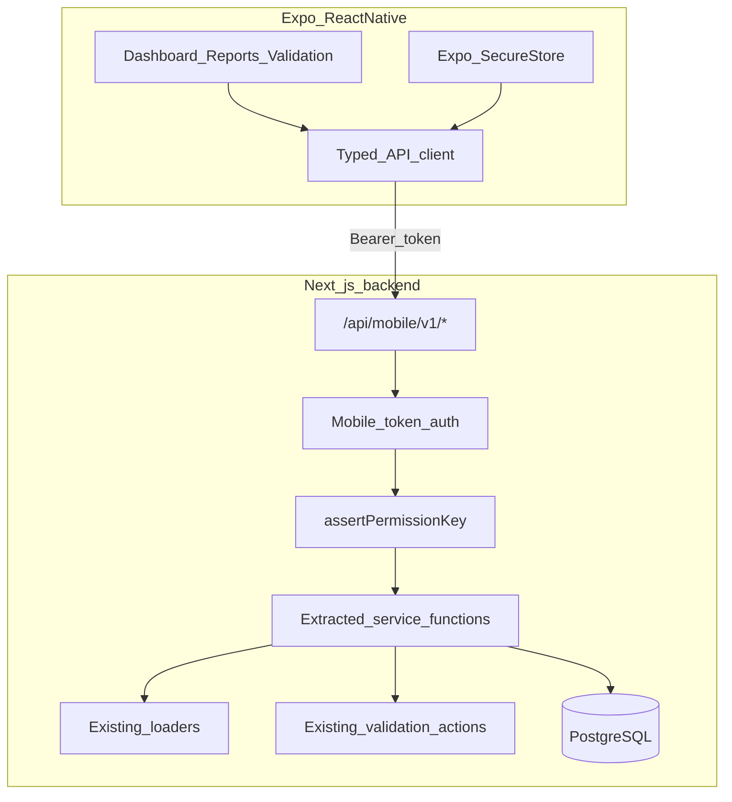

# Mobile monitoring app (React Native + secure API)

## Current state (what you already have)

Your web app is a **Next.js monolith** where data flows through **RSC pages + server actions**, not REST. Auth is **Auth.js with JWT session cookies** ([`auth.config.ts`](auth.config.ts), [`lib/auth-server.ts`](lib/auth-server.ts)). Authorization is already strong: **permission keys** (`route:/reports/stock-inquiry`, `ui:validate-documents`, etc.) resolved in [`lib/access-control.ts`](lib/access-control.ts) and enforced via [`proxy.ts`](proxy.ts) → [`/api/access/authorize`](app/api/access/authorize/route.ts).

Report logic is well-isolated in co-located **`loader.ts`** files (e.g. [`stock-inquiry/loader.ts`](<app/(app)/reports/(stock)/stock-inquiry/loader.ts>), [`stock-vs-commitments/loader.ts`](<app/(app)/reports/(stock)/stock-vs-commitments/loader.ts>)). Validation logic lives in server actions ([`pos/actions.ts`](<app/(app)/pos/actions.ts>) `validateSale`, [`delivery-orders/validation-queue/actions.ts`](<app/(app)/delivery-orders/validation-queue/actions.ts>)).

**Gap:** React Native cannot call server actions or consume RSC HTML. You need a **JSON API** that calls the same business logic and the same permission checks.



---

## Recommended approach: Expo + API layer (not WebView)

| Option                   | Fit for your app                                                           |
| ------------------------ | -------------------------------------------------------------------------- |
| **Expo (React Native)**  | Best long-term: native UX, offline-ready later, shares TypeScript with web |
| WebView wrapping web app | Fast but poor UX, cookie fragility, hard to optimize for mobile            |
| PWA only                 | Zero new client; good fallback, but you asked for React Native             |

Use **Expo** (`mobile/` folder in the same repo) with **React Navigation**, **TanStack Query** for fetching/caching, and **Expo SecureStore** for tokens.

---

## Security model (critical)

### Do not rely on session cookies for the native app

Cookies are awkward in React Native and easy to misconfigure. Add a **dedicated mobile auth flow**:

1. **`POST /api/mobile/v1/auth/login`** — username/password (same bcrypt check as [`auth.ts`](auth.ts)); on success issue:
   - **Access token** (short-lived, e.g. 15–60 min)
   - **Refresh token** (longer-lived, stored server-side or as signed refresh JWT with rotation)
2. **`POST /api/mobile/v1/auth/refresh`** — rotate tokens
3. **`POST /api/mobile/v1/auth/logout`** — revoke refresh token
4. **`GET /api/mobile/v1/me`** — returns sanitized session + **effective permission map** (same shape as web uses internally)

Implementation sketch:

- New Prisma model `MobileRefreshToken` (userId, tokenHash, expiresAt, deviceLabel?) for revocation
- Access token JWT claims: `userId`, `sub`, `iat`, `exp` — **reload full `AuthSession` from DB on each request** via existing [`loadAuthSessionByUserId`](lib/load-auth-session.ts) so role/permission changes apply without reinstall
- Reuse **`assertPermissionKey`** and **`getPermissionsForSession`** from [`lib/access-control.ts`](lib/access-control.ts) on every mobile route
- Restrict mobile login to target roles: `SUPERVISOR`, `SENIOR_SUPERVISOR`, `MANAGER`, `ADMIN`, `DIRECTOR` (plus line-role equivalents via commercial service roles)

### API route protection

- Prefix all mobile endpoints: **`/api/mobile/v1/...`**
- Add explicit mapping in [`lib/resolve-route-permission.ts`](lib/resolve-route-permission.ts) (pattern started in [`.cursor/plans/api_customers_mobile_4e70aad0.plan.md`](.cursor/plans/api_customers_mobile_4e70aad0.plan.md)):
  - `/api/mobile/v1/reports/stock-inquiry` → `route:/reports/stock-inquiry`
  - `/api/mobile/v1/validation/sales/:id/validate` → `ui:validate-documents`
  - `/api/mobile/v1/validation/delivery-orders/...` → `route:/delivery-orders/validation-queue` or `ui:validate-delivery-orders`
- Shared wrapper: `lib/api/mobile/with-mobile-auth.ts` — parse Bearer header, load session, assert permission, return consistent `{ error }` JSON with 401/403/400

### Hardening checklist

- HTTPS only in production; reject plain HTTP
- Rate-limit login (e.g. middleware or Upstash)
- `Cache-Control: no-store` on all mobile responses
- Serialize `Prisma.Decimal` as strings in JSON
- Audit validation mutations (reuse existing DB writes; no duplicate business rules)
- Optional later: cert pinning, biometric unlock (local only), push for pending queue counts

---

## Backend refactor: extract services (avoid duplicating logic)

Create **`lib/services/`** (or `lib/mobile/`) and move core logic out of pages/actions so **web and mobile share one implementation**:

| Service function                                | Source today                                                                                    | Mobile endpoint                                                    |
| ----------------------------------------------- | ----------------------------------------------------------------------------------------------- | ------------------------------------------------------------------ |
| `getExecutiveDashboardSummary(session)`         | [`ExecutiveDashboard.tsx`](<app/(app)/dashboard/variants/ExecutiveDashboard.tsx>) inline Prisma | `GET /api/mobile/v1/dashboard/executive`                           |
| `getLineDashboardSummary(session, serviceCode)` | Palm/rubber dashboard variants                                                                  | `GET /api/mobile/v1/dashboard/lines/:code`                         |
| `loadStockInquiryReport(...)`                   | existing loader                                                                                 | `GET /api/mobile/v1/reports/stock-inquiry?...`                     |
| `loadStockVsCommitmentsReport(...)`             | existing loader                                                                                 | `GET /api/mobile/v1/reports/stock-vs-commitments?...`              |
| `loadDoCommitmentCrosstab(...)`                 | existing loader                                                                                 | `GET /api/mobile/v1/reports/commitments`                           |
| `loadDailySalesSummary(...)`                    | existing loader                                                                                 | `GET /api/mobile/v1/reports/daily-sales-summary?...`               |
| `listPendingSalesForValidation(session)`        | [`pos/actions.ts`](<app/(app)/pos/actions.ts>) (~line 753)                                      | `GET /api/mobile/v1/validation/sales`                              |
| `validateSaleById(session, saleId)`             | extract from `validateSale` FormData action                                                     | `POST /api/mobile/v1/validation/sales/:id/validate`                |
| `listPendingDeliveryOrdersForValidation(...)`   | validation-queue actions                                                                        | `GET /api/mobile/v1/validation/delivery-orders`                    |
| `validateReviewedDeliveryOrders(...)`           | validation-queue actions                                                                        | `POST /api/mobile/v1/validation/delivery-orders/validate-reviewed` |

Web pages/actions become thin wrappers calling these services (incremental migration—start with mobile-only extraction, refactor web when touching the same code).

Add **`lib/api/mobile/serialize.ts`** for Decimal/date normalization shared across endpoints.

---

## Shared types package

Add **`packages/shared/`** (or `lib/shared-mobile/` if you prefer no workspace tooling initially):

- API response types mirroring loader DTOs (with `Decimal` → `string`)
- Endpoint path constants
- Client-safe enums from [`lib/domain.ts`](lib/domain.ts)

Both Next.js and Expo import from here so mobile screens stay in sync with backend contracts.

---

## Expo app structure (`mobile/`)

```
mobile/
  app/                    # Expo Router screens
    (auth)/login.tsx
    (app)/
      index.tsx           # role-based home
      reports/
      validation/
  src/
    api/client.ts         # fetch + Bearer + refresh interceptor
    auth/AuthProvider.tsx
    hooks/usePermissions.ts
    components/           # summary cards, report tables (reuse layout ideas from web)
  app.json
  package.json
```

### v1 screens (your chosen scope: monitoring + approvals)

**All roles (permission-gated):**

- Login + session/profile
- Home dashboard (executive for Admin/Director; line dashboard for others — same rules as [`lib/dashboard-routing.ts`](lib/dashboard-routing.ts))
- Reports hub (only reports the user’s permission map allows)
- Report detail: stock inquiry, stock vs commitments, daily sales summary, DO commitments summary

**Approval flows (role-gated):**

- **Pending sales** — supervisors+ with `ui:validate-documents` ([`canValidateDocuments`](lib/auth-roles.ts))
- **DO validation queue** — managers with `route:/delivery-orders/validation-queue` (two-step: mark reviewed → validate reviewed, same as web)

UI pattern: reuse the **3-card summary + detail tables** pattern from [`StockVsCommitmentsSummaryCards.tsx`](<app/(app)/reports/(stock)/stock-vs-commitments/StockVsCommitmentsSummaryCards.tsx>) for mobile-friendly monitoring.

---

## Phased delivery

### Phase 1 — Foundation (1–2 weeks)

- Mobile auth endpoints + `MobileRefreshToken` model + migration
- `with-mobile-auth` helper + permission path mapping
- `GET /api/mobile/v1/me`
- Expo app shell: login, token storage, `/me` profile, permission hook
- Register mobile routes in [`lib/access-control-keys.ts`](lib/access-control-keys.ts) and [`lib/commercial-modules.ts`](lib/commercial-modules.ts) (`palm_reports` module)

### Phase 2 — Monitoring (1–2 weeks)

- Dashboard JSON endpoints (executive + line)
- Wrap 4–5 high-value report loaders as GET APIs with same query params as web
- Mobile reports list + detail screens

### Phase 3 — Approvals (1–2 weeks)

- Pending sales list + validate endpoint (extract from [`validateSale`](<app/(app)/pos/actions.ts>))
- DO validation queue list + mark-reviewed + validate-reviewed (from [`validation-queue/actions.ts`](<app/(app)/delivery-orders/validation-queue/actions.ts>))
- Mobile validation inbox with optimistic UI + error toasts

### Phase 4 — Polish

- Pull-to-refresh, loading skeletons, deep links
- Optional push notifications when pending counts > 0
- EAS Build for iOS/Android distribution (internal TestFlight / APK)

---

## What stays unchanged on web

- Existing RSC pages, server actions, and sidebar continue to work
- Same PostgreSQL, Prisma, permission DB, commercial module gating
- No need to rewrite reports—only **expose** existing loaders via JSON

---

## Key risks and mitigations

| Risk                                       | Mitigation                                                                         |
| ------------------------------------------ | ---------------------------------------------------------------------------------- |
| Duplicated business logic                  | Extract services before adding many endpoints                                      |
| Unmapped `/api/*` paths allowed by default | Explicit map every mobile path in `resolve-route-permission.ts`                    |
| Stale JWT permissions                      | Reload `AuthSession` from DB per request; short access token TTL                   |
| Validation bugs on mobile                  | Call same functions as web actions; add integration tests for API routes           |
| Role confusion (line vs legacy roles)      | Use `getPermissionsForSession(session)` — already handles commercial service roles |

---

## Suggested first PR (smallest vertical slice)

1. Prisma `MobileRefreshToken` + `POST/GET /api/mobile/v1/auth/*` + `GET /me`
2. One read-only endpoint: `GET /api/mobile/v1/reports/stock-vs-commitments` wrapping existing loader
3. Expo login screen + one report screen proving end-to-end auth, permissions, and JSON serialization

This validates the architecture before building the full validation and dashboard surface.
