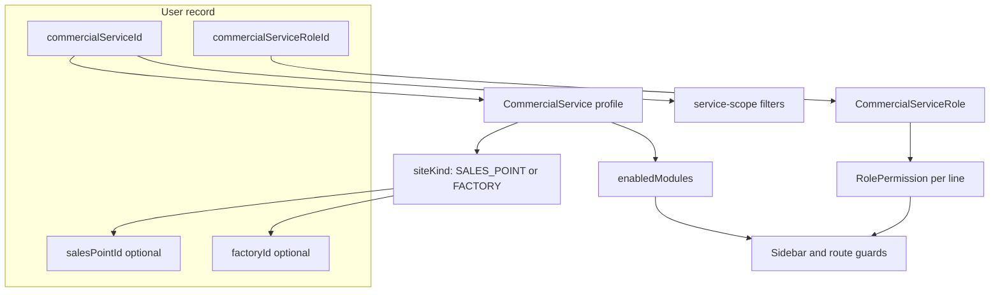

# Multi-line commercial services: profiles, factories, and service roles

## Your situation (confirmed)

- **Palm Oil**: sales points, collection-point stock, BPO, delivery orders, existing global roles (`CLERK`, `SUPERVISOR`, `CLERK_IN_CHARGE_BPO`, etc.).
- **Rubber Sales**: **factories** (not sales points), **different workflows** (several palm-oil modules likely irrelevant), and **different role titles/hierarchy**.

You already have the right **first layer** from the recent work: [`lib/service-scope.ts`](lib/service-scope.ts) filters data by `commercialServiceId` on reads/writes. The next layer is **how each line is allowed to operate**, not just which rows they see.

## Recommended pattern: one app, profile-driven operating modes

Do **not** split into two Next.js apps or two databases. Do **not** scatter `if (code === 'rubber')` across dozens of files—that becomes unmaintainable as soon as a third line appears.

Instead, treat each [`CommercialService`](prisma/schema.prisma) as an **operating profile** that drives three orthogonal concerns:



| Concern                   | Today                                                                                  | Target                                                                     |
| ------------------------- | -------------------------------------------------------------------------------------- | -------------------------------------------------------------------------- |
| **Data isolation**        | `commercialServiceId` on Sale/DO/User                                                  | Keep; already in [`lib/service-scope.ts`](lib/service-scope.ts)            |
| **Where users post**      | `User.salesPointId` + [`lib/auth-sales-point-scope.ts`](lib/auth-sales-point-scope.ts) | **Profile decides**: sales point _or_ factory (mutually exclusive by line) |
| **What users can open**   | Global `UserRole` + [`RolePermission`](prisma/schema.prisma) keyed by role             | **Service role** + permissions **per commercial line**                     |
| **Which workflows exist** | Implicit (whole app is palm-oil-shaped)                                                | **Module flags** on profile (BPO, DO, stock receive, etc.)                 |

Leadership (`ADMIN`, `DIRECTOR`, `MANAGER`) stays **global**: they keep seeing all lines via `roleSeesAllCommercialServices` and optional service filter later. Line staff get a **commercial service role** from that line’s catalog only.

---

## 1. Commercial operating profile (config on `CommercialService`)

Add structured config (columns or a 1:1 `CommercialServiceProfile` table—prefer table if you expect many fields):

- **`siteKind`**: `SALES_POINT` | `FACTORY` — drives UI labels (“Collection point” vs “Factory”) and which FK on `User` is required.
- **`enabledModules`**: string array or JSON list of module keys aligned with existing route permission keys in [`lib/access-control-keys.ts`](lib/access-control-keys.ts), e.g. `pos`, `delivery-orders`, `bpo-sales`, `stock/receive`, …
- Optional: **`defaultRoleId`**, display metadata, sort order (you already have `code`, `name`, `invoicePrefix`).

Central loader, e.g. [`lib/commercial-profile.ts`](lib/commercial-profile.ts):

```ts
export function resolveCommercialProfile(session): CommercialProfile;
export function assertModuleEnabled(profile, moduleKey): void;
export function siteLabel(profile): "Sales point" | "Factory";
```

**Nav** ([`app/(app)/Sidebar.tsx`](<app/(app)/Sidebar.tsx>)): build groups from `enabledModules ∩ userPermissions`, not a single static list for everyone.

**Server actions**: at the top of palm-only actions (`bpo-*`, `delivery-orders`, etc.), call `assertModuleEnabled` so rubber users cannot hit APIs by URL.

---

## 2. Factories as a first-class site (rubber), not a rename of sales points

Because workflows differ, avoid overloading [`SalesPoint`](prisma/schema.prisma) with a `kind` flag if rubber documents and stock rules diverge materially—you will end up with nullable palm-only relations on every factory row.

**Add `Factory`** (minimal start):

- `id`, `name`, `commercialServiceId`, `isActive`
- Mirror setup UX of sales points under Setup or a rubber-specific admin page

**User assignment**:

- Keep `salesPointId` for palm lines.
- Add `factoryId` for rubber lines.
- Enforce in [`app/(app)/users/actions.ts`](<app/(app)/users/actions.ts>): if profile `siteKind === FACTORY`, require `factoryId` and clear `salesPointId` (and vice versa).

**Posting documents** (phased):

- **Phase R1**: Rubber uses **dedicated screens/actions** that set `factoryId` on new tables or new optional columns—do not force rubber through palm POS/DO until requirements are clear.
- **Phase R2** (only if truly shared): introduce optional `factoryId` on `Sale` / `DeliveryOrder` _or_ a polymorphic `postingSiteType` + `postingSiteId`—larger migration across ~18 `salesPointId` usages in schema; defer until rubber workflows are specified.

Generalize [`lib/auth-sales-point-scope.ts`](lib/auth-sales-point-scope.ts) → `lib/posting-site-scope.ts` that reads profile + `session.salesPoint` or `session.factory`.

---

## 3. Service-scoped roles (different titles per line)

Global [`UserRole`](lib/domain.ts) is palm-oil-centric (`CLERK_IN_CHARGE_BPO`, etc.). Rubber needs its own catalog.

**Add models**:

- `CommercialServiceRole`: `id`, `commercialServiceId`, `code` (stable key), `name` (display), `sortOrder`, `isActive`
- `CommercialServiceRolePermission`: `commercialServiceRoleId`, `permissionKey` (same keys as today’s [`PERMISSION_KEYS`](lib/access-control-keys.ts))

**User changes**:

- Operational users: `commercialServiceRoleId` (required) + keep global `role` only for leadership **or** map leadership to `ADMIN`/`DIRECTOR`/`MANAGER` without a service role.
- [`auth.ts`](auth.ts) login: validate assignment matches profile (`siteKind`, active service, active service role).
- Session/JWT ([`lib/load-auth-session.ts`](lib/load-auth-session.ts)): include `commercialServiceRole: { id, code, name }`.

**Permissions resolution** ([`lib/access-control.ts`](lib/access-control.ts)):

```ts
getPermissionsForUser(session):
  if leadership global role → existing defaults + all lines OR filter by active service
  else → CommercialServiceRolePermission rows for session.commercialServiceRoleId
```

Update Setup → Permissions ([`app/(app)/setup/permissions/`](<app/(app)/setup/permissions/>)) to edit permissions **per commercial line and service role**, not only global `UserRole`.

**Do not** add ten new values to the global `UserRole` enum for every rubber title—that does not scale to a third product line.

---

## 4. How this fits what you already built

| Existing piece                                         | Role in the new model                                                                        |
| ------------------------------------------------------ | -------------------------------------------------------------------------------------------- |
| [`resolveServiceScope`](lib/service-scope.ts)          | Still filters **which rows** (invoices, DOs) by `commercialServiceId`                        |
| `roleSeesAllCommercialServices`                        | Leadership bypass for data scope                                                             |
| `productWhereForScope` / `Product.commercialServiceId` | Catalog per line (already started)                                                           |
| `RolePermission` (global)                              | Becomes **legacy defaults** for leadership; line staff use `CommercialServiceRolePermission` |

Data scope and operating profile are **orthogonal**: a rubber factory clerk must pass **both** checks—module enabled + factory scope + commercial service on the document.

---

## 5. Phased rollout (practical order)

### Phase 1 — Profile + modules (low risk, unlocks nav)

- Schema: profile fields on `CommercialService` (or profile table).
- Seed: palm-oil profile (`siteKind: SALES_POINT`, full module list); rubber profile (`siteKind: FACTORY`, minimal modules).
- `lib/commercial-profile.ts` + Sidebar/route `assertModuleEnabled`.
- No Factory table yet if rubber screens are not ready—block rubber operational login or show “setup incomplete” until Phase 2.

### Phase 2 — Service roles + permissions UI

- `CommercialServiceRole` + permissions tables; seed rubber role titles you define with business.
- Users admin: pick **line → service role → factory/sales point** based on profile.
- Replace `defaultPermissionsForRole(role)` for line staff with DB-backed service role permissions.

### Phase 3 — Factory entity + rubber workflows

- `Factory` CRUD; user assignment; session `factory` in auth payload.
- Build **rubber-specific** flows (requirements workshop: sales entry, stock, reports—explicitly **not** palm POS/BPO unless you decide to reuse).
- `posting-site-scope` for rubber actions.

### Phase 4 — Shared documents (optional)

- Only if rubber and palm share the same `Sale`/`DeliveryOrder` tables: add `factoryId` or polymorphic site; migrate reports. Skip if rubber is a separate document model.

---

## What to avoid

| Approach                                       | Why not                                                                         |
| ---------------------------------------------- | ------------------------------------------------------------------------------- |
| Separate apps per line                         | Double deploy, shared customers/settings pain                                   |
| `if (rubber)` in every action                  | Third line breaks the pattern                                                   |
| One global `UserRole` enum for all lines       | Rubber titles and BPO clerk do not fit one list                                 |
| Factories = SalesPoint with renamed label only | You said workflows differ—shared FKs drag palm-only stock/BPO rules into rubber |

---

## Decisions to nail in a short workshop (before Phase 3)

1. **Rubber document set**: sales invoices only, or also DOs, consignment notes, stock at factory?
2. **Shared customers/products** across lines or tagged per `commercialServiceId` (you started product tagging)?
3. **Leadership**: one login sees both lines with module filter, or separate admin users per line?

---

## Summary

**Best approach for your scenario**: keep **one database and one app**, extend **`CommercialService` into an operating profile** (site kind + enabled modules), add **service-scoped roles and permissions** for different job titles per line, and model **Factories separately** with rubber-specific workflows—while **`service-scope`** continues to enforce which line’s data each user sees.

This matches how multi-line ERPs are usually built: **profile + module matrix + scoped roles + site abstraction**, not separate products per division.
