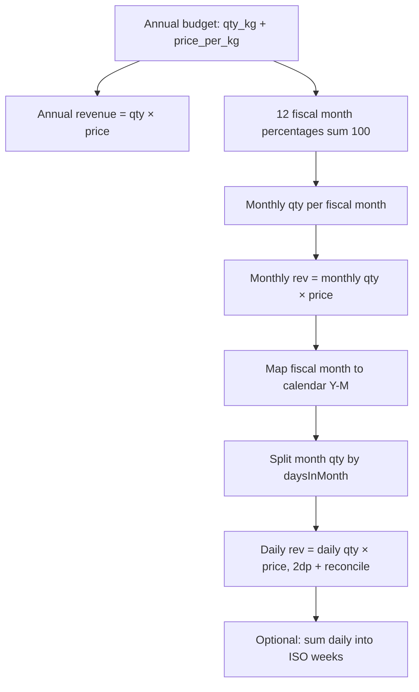

# Sales budget phasing (annual → monthly → day-based, qty + revenue)

## Context in this codebase

- **Financial year**: [`FinancialYearPeriod`](c:\Users\user\Desktop\sales-project\pos-app\prisma\schema.prisma) (`financialYear`, `startDate`, `endDate`). Only one OPEN period at a time (enforced in app code).
- **“12 months”**: Posting already uses **calendar months fully inside** FY bounds — see [`listSelectableCalendarMonths`](c:\Users\user\Desktop\sales-project\pos-app\lib\posting-calendar.ts). Fiscal month index 1–12 and mapping to calendar month/year come from [`lib/fiscal.ts`](c:\Users\user\Desktop\sales-project\pos-app\lib\fiscal.ts) (`calendarMonthForFiscalMonth`, `CompanySettings.fiscalYearStartMonth`).
- **Products**: [`Product`](c:\Users\user\Desktop\sales-project\pos-app\prisma\schema.prisma) with `productId`; sale quantities are kg `Decimal` on [`SaleLine`](c:\Users\user\Desktop\sales-project\pos-app\prisma\schema.prisma) with [`unitPricePerKg`](c:\Users\user\Desktop\sales-project\pos-app\prisma\schema.prisma) `Decimal(14, 2)` — budget fields should mirror those types (`annualQtyKg` `Decimal(14,3)`, **`budgetUnitPricePerKg` `Decimal(14,2)`**).

There is **no existing budget** model; this is new schema + library + UI/permissions.

## Requirements (locked in)

| Topic                     | Decision                                                                                                                                                                                                                                                                                                                      |
| ------------------------- | ----------------------------------------------------------------------------------------------------------------------------------------------------------------------------------------------------------------------------------------------------------------------------------------------------------------------------- |
| Grain                     | **Per product only** (company-wide, not per sales point).                                                                                                                                                                                                                                                                     |
| Budget inputs             | **Annual quantity (kg)** and **budgeted unit price per kg** for each `(financialYear, product)`; **annual budget revenue** = `annualQtyKg × budgetUnitPricePerKg` (stored or computed—see model).                                                                                                                             |
| Month split (qty)         | Annual qty × twelve **percentage** weights that **sum to 100%**, keyed to **fiscal months 1–12** (same ordering as the rest of the app).                                                                                                                                                                                      |
| Revenue phasing           | **Do not** apply a separate percentage curve to revenue. **Revenue at each bucket** = **phased quantity in that bucket × `budgetUnitPricePerKg`**. This keeps qty and revenue aligned and avoids conflicting rounding rules between two phased series.                                                                        |
| Sub-month split (qty)     | Use **`daysInMonth`** for the **calendar month** that corresponds to each fiscal month: **equal per calendar day** — `monthQty / daysInMonth` per day (see rounding below).                                                                                                                                                   |
| Sub-month split (revenue) | After daily quantities are fixed, **daily revenue** = `dailyQty × budgetUnitPricePerKg`, rounded to **2 decimal places**, with **reconciliation** so daily revenues in a month sum to **monthly revenue** = `monthlyQty × budgetUnitPricePerKg` (same idea as qty: adjust the **last day of the month** for money remainder). |

**Week labels (1–53)**: Define **daily budget qty (and revenue)**; if reports need week-of-year figures, **rollup** by summing daily amounts for each ISO week (`isoWeekYear`, `isoWeek`) intersecting the calendar month.

## Rounding and reconciliation

Use **`Decimal`** for stored **qty** and **price**; **money** outputs at **2 dp**.

1. **Annual → monthly (qty)**: `monthlyQty[m] = round(annualQty * pct[m] / 100)` with reconciliation so the 12 monthly qty values sum to `annualQty` (e.g. largest remainder).
2. **Monthly (revenue target)**: `monthlyRev[m] = round(monthlyQty[m] * budgetUnitPricePerKg, 2dp)` — if needed, reconcile the **last fiscal month** so ∑`monthlyRev` = `round(annualQty * budgetUnitPricePerKg, 2dp)` **or** accept that annual revenue display = sum of reconciled monthly revenues after qty reconciliation (document one rule: prefer **sum of phased monthly rev** as the “phased annual revenue” to match phased qty).
3. **Monthly → daily (qty)**: `base = monthlyQty / daysInMonth`; round per day; adjust **last calendar day** so daily qty sums to `monthlyQty`.
4. **Monthly → daily (revenue)**: For each day, `dailyRev = round(dailyQty * budgetUnitPricePerKg, 2dp)`; adjust **last calendar day** so ∑`dailyRev` equals the **target monthly revenue** (`monthlyQty * price` at 2dp, or the reconciled `monthlyRev[m]` from step 2—pick one chain and use it consistently in code).

**Principle**: Percentages only drive **quantity**; **revenue follows quantity × price** at each tier with explicit 2dp reconciliation.

## Data model (Prisma)

1. **`ProductSalesBudget`**: `id`, `financialYear`, `productId`, `annualQtyKg` `Decimal(14,3)`, **`budgetUnitPricePerKg` `Decimal(14,2)`**, `createdAt` / `updatedAt`, **`@@unique([financialYear, productId])`**. Optional derived column `annualBudgetRevenue` is redundant if always computed in queries/UI; omit from DB unless you want a persisted snapshot for auditing.
2. **`SalesBudgetMonthPhaseProfile`**: twelve weights summing to **100%**, validated in server action (tolerance e.g. ±0.01). Start with a **single global** profile (or `CompanySettings` FK) unless FY-specific profiles are required later.

**Materialization**: Store **annual qty + unit price + profile**; compute **monthly/daily qty and revenue** in [`lib/`](c:\Users\user\Desktop\sales-project\pos-app) for previews and reports.

## Library layer

New module e.g. [`lib/sales-budget-phase.ts`](c:\Users\user\Desktop\sales-project\pos-app\lib\sales-budget-phase.ts):

- Inputs: FY bounds, `fiscalYearStartMonth`, `annualQty`, **`budgetUnitPricePerKg`**, `pct[1..12]`.
- Output: For each included fiscal/calendar month: `monthlyQty`, **`monthlyRevenue`**; for each day: `dailyQty`, **`dailyRevenue`**; optional ISO-week rollups for **both** qty and revenue.
- Reuse UTC date helpers from [`lib/posting-calendar.ts`](c:\Users\user\Desktop\sales-project\pos-app\lib\posting-calendar.ts). Only include calendar months **fully inside** FY bounds (same rule as posting).

## App surface (v1)

- **Setup / admin**: Edit **monthly % profile** (12 inputs, sum 100%).
- **Budget entry**: For chosen `financialYear`, per product: **annual qty (kg)** and **budget $/kg**; show **derived annual revenue** read-only.
- **Preview**: Phased **monthly and daily** tables with **quantity and revenue** columns (and collapsible weekly rollup).

Follow existing **`RolePermission`** pattern for `route:/...`.

## Migration and seed

- Prisma migrate for new models.
- Optional seed: default flat ~8.333% profile; sample budgets optional.

## Out of scope (unless requested)

- Per sales point budgets.
- VAT on budget revenue (could add later using `CompanySettings.vatRate`).
- POS enforcement against budget.
- Versioning of % profiles or historical price snapshots.
