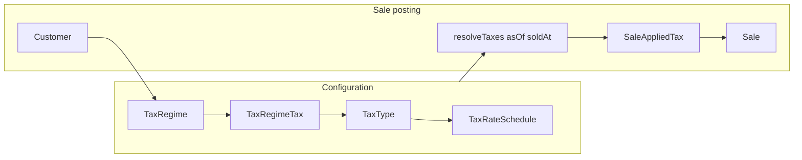

# Sales tax harmonization (regime + effective rates)

## Context (current state)

- [`prisma/schema.prisma`](prisma/schema.prisma): `TaxRegime` is only `name` + `vatApplies`. `CompanySettings` holds a single global `vatRate`. `Sale` stores `vatRateSnapshot`, `netAmount`, `vatAmount`, `grossAmount`; `SaleLine` has `lineVat` / `lineGross`. `DeliveryOrderDetails` already has `vatRate`, `vatAmount`, `otherTaxLabel`, `otherTaxAmount` (partial multi-tax at DO only).
- [`app/(app)/pos/actions.ts`](app/(app)/pos/actions.ts): VAT rate = `customer.taxRegime.vatApplies ? settings.vatRate : 0` (no date-aware rate).
- POS UI ([`app/(app)/pos/SalesClient.tsx`](app/(app)/pos/SalesClient.tsx), [`app/(app)/pos/page.tsx`](app/(app)/pos/page.tsx)): preview uses global `vatRateDecimal` + `vatApplies` boolean.
- [`components/SalePrint.tsx`](components/SalePrint.tsx): single “VAT” line; `vatApplies` on print payload comes from **current** customer regime in [`loadSalePrintById`](app/(app)/pos/actions.ts) — not ideal for audit once regimes change.

## Design decisions (locked)

- **Stacking (user confirmed: A)**: **Additive on net** — every applicable tax uses the same ex-tax base; `gross = net + sum(taxAmounts)`. No sequential/compound taxes in v1 (can extend later with an `order` / `base` enum if needed).
- **Authority**: Rates and “which tax exists” are **UI-managed**; application to a sale is **derived** from customer `taxRegimeId` + **transaction date** (`soldAt` / `transactionDate` already normalized in `createSale`).
- **Audit**: Persist **snapshots** on the sale (and lines) so historical invoices do not change when regimes or schedules change.

## Data model (Prisma)

Add entities (names can be adjusted to taste):

1. **`TaxType`** — catalog row per levy (e.g. code `VAT`, display name, optional `sortOrder` for UI/print).
2. **`TaxRateSchedule`** — `taxTypeId`, `rate` (`Decimal(5,4)`), `effectiveFrom` (`DateTime @db.Date` or date-only semantics in app). Uniqueness: no overlapping rows per type (enforce in app: for a given `asOf` date, pick the row with latest `effectiveFrom` ≤ `asOf`).
3. **`TaxRegimeTax`** — join `taxRegimeId` + `taxTypeId` (which taxes apply to this regime). Replaces the need for `vatApplies` long-term; **migration path**: for each regime, if `vatApplies`, link the seeded `VAT` `TaxType`.

**`Sale` extensions**

- Add relation **`SaleAppliedTax`** (or `SaleTaxLine`): `saleId`, `taxTypeId` (optional FK), `codeSnapshot`, `labelSnapshot`, `rateSnapshot`, `amount` — one row per tax applied on that invoice.
- Keep existing `vatAmount` / `vatRateSnapshot` for **backward compatibility** during transition:
  - Define **`vatAmount` = sum of amounts** where `codeSnapshot === 'VAT'` (or linked type is VAT), and **`vatRateSnapshot`** = that VAT rate when exactly one VAT row exists; otherwise store `0` or primary VAT rate per product decision (document in code).
- **`SaleLine`**: either add nullable `lineTaxJson` / child `SaleLineAppliedTax` rows, or **allocate** each header tax to lines proportionally by `lineNet / net` (keeps DB simple; totals still exact at header). Recommendation: **header `SaleAppliedTax` + proportional line split** for `lineVat`/`lineGross` only if reports need per-line VAT; otherwise set `lineVat` = sum of line’s share of all taxes and `lineGross` = `lineNet + lineVat` for consistency with today’s shape.

**`CompanySettings.vatRate`**

- After migration: treat as **legacy** or remove from setup UI in favor of managing **`TaxRateSchedule`** for `VAT`. Seed initial schedule from current `CompanySettings.vatRate` with `effectiveFrom` = company open date or a fixed migration date.

## Shared resolution module

New e.g. [`lib/tax/resolve.ts`](lib/tax/resolve.ts):

- Input: `taxRegimeId`, `asOf: Date` (UTC date boundary consistent with [`noonUtcFromIsoDate`](lib/posting-calendar.ts)).
- Steps: load regime’s `TaxRegimeTax` → for each `TaxType`, load active `TaxRateSchedule` row for `asOf` → return `{ taxTypeId, code, label, rate }[]`.
- Used by: `createSale`, POS preview API/props, delivery order line computation ([`app/(app)/delivery-orders/actions.ts`](app/(app)/delivery-orders/actions.ts)), and any future reports.

## Application layer changes

| Area | Change |
|------|--------|
| **POS server** [`createSale`](app/(app)/pos/actions.ts) | Replace `settings.vatRate` + `vatApplies` with `resolveTaxesForRegime(..., soldAt)`; compute each tax amount = `money2(net * rate)`; `gross = net + sum`; insert `SaleAppliedTax` rows; set legacy `vatAmount`/`vatRateSnapshot` per compatibility rule. |
| **POS page / client** | Pass resolved taxes (or a small server helper) keyed by **customer + transaction date** so preview matches server. Replace single `vatRateDecimal` prop with structured taxes + totals. |
| **Tax regimes UI** [`TaxRegimesClient`](app/(app)/tax-regimes/TaxRegimesClient.tsx) | Add management for linked taxes (multi-select of `TaxType`). Optionally keep `vatApplies` as a **synced shortcut** (“VAT applies” toggles VAT in the join table) to avoid confusing existing users. |
| **New admin UI** | CRUD for `TaxType` + `TaxRateSchedule` (list rows per type, `effectiveFrom`, rate). Guardrails: warn if `asOf` has no rate for a regime-linked tax. |
| **Print** [`SalePrint`](components/SalePrint.tsx) | Replace single VAT row with **dynamic list** of applied taxes from snapshots (`SaleAppliedTax`), and drive “VAT applies” text from **snapshots** (e.g. “VAT: 19.25% — …”) not live customer regime. |
| **Delivery orders** | Replace `companyVatRate` + `vatApplies` with same resolver + optional `otherTax` mapping to additional `TaxType`s (retire ad-hoc `otherTaxLabel` where possible, or map label → type in v2). |
| **Reports** | Anywhere summing `sale.vatAmount` remains valid if `vatAmount` stays VAT-only; add columns for **total non-VAT taxes** if needed from `SaleAppliedTax`. |

## Migrations and seed

1. Prisma migration creating new tables + `SaleAppliedTax`.
2. Data migration script (or seed step): create `TaxType` VAT; insert `TaxRateSchedule` from each env’s `CompanySettings.vatRate`; for each `TaxRegime`, if `vatApplies`, insert `TaxRegimeTax` for VAT.
3. Optional: backfill `SaleAppliedTax` for old sales from existing `vatRateSnapshot`/`vatAmount` (single synthetic row) for consistent reporting.

## Testing / verification

- Unit tests for resolver: no schedule, boundary on `effectiveFrom`, multiple types, regime with no taxes (gross = net).
- Manual: create sale with transaction date before/after a rate change; confirm snapshot and print differ correctly.

