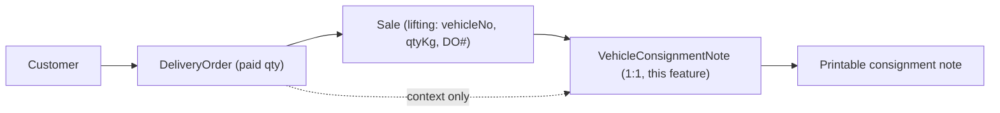

## Design summary

A consignment note is **1:1 with a `Sale`**. The user opens the form, looks up a Sale (which already carries `deliveryOrderNo`, `vehicleNumber`, `salesPoint`, customer, and lifted `qtyKg`), then fills in destination/consignee/receiver/NIC fields. The DO context (paid qty / already lifted / balance) is shown read-only for the loaded Sale's DO.

### Data flow

### Workflow / roles

- Draft (create/edit/delete pending): `CLERK` + `ADMIN`
- Validate: `SUPERVISOR` + `ADMIN`
- Validated notes become read-only (mirrors DO behavior)

### Fields captured on the note (saved on `VehicleConsignmentNote`)

- `consignmentNoteNo` (auto: `VCN-YYYY-000001`)
- `saleId` (unique FK to `Sale`)
- `destination` (free text; defaulted from `Customer.address`)
- `dateOfLifting` (date; defaults to `Sale.soldAt`)
- `vehicleNumber` snapshot (defaults to `Sale.vehicleNumber`, editable)
- `consigneeName` (defaults to `Customer.name`)
- `dateOfConsignment` (date)
- `receiverName`, `receiverNicNo`, `receiverNicPlaceOfIssue`
- `receivedDate` (nullable)
- `status`, `validatedAt`, `validatedByUserId`, `createdByUserId`, audit timestamps

Auto-derived from `Sale` for display/print (no copy):

- From: `Sale.salesPoint.name`
- DO no.: `Sale.deliveryOrderNo`
- DO paid qty: sum of `DeliveryOrderDetails.orderQty` (matched on DO no.)
- Already lifted: sum of validated `SaleLine.qtyKg` across sales with same `deliveryOrderNo`
- Balance: paid - lifted

## Files

### New

- [prisma/schema.prisma](prisma/schema.prisma) — add `VehicleConsignmentNote` model + `VehicleConsignmentNoteSequence` + `ValidationStatus` reuse, plus `consignmentNote VehicleConsignmentNote?` on `Sale`.
- [lib/consignment-note-no.ts](lib/consignment-note-no.ts) — `allocateConsignmentNoteNo(date)` mirroring [lib/delivery-order-no.ts](lib/delivery-order-no.ts).
- [app/(app)/consignment-notes/page.tsx](<app/(app)/consignment-notes/page.tsx>) — server page that fetches the user's accessible Sales (or by-number lookup) and renders the client form.
- [app/(app)/consignment-notes/ConsignmentNotesClient.tsx](<app/(app)/consignment-notes/ConsignmentNotesClient.tsx>) — form mirroring `DeliveryOrdersClient` patterns: lookup by Sale invoice no. or by VCN no., load -> auto-fill From/DO/vehicle/consignee/qty context, then user enters destination, dates, receiver, NIC; Save header, Validate, Delete.
- [app/(app)/consignment-notes/actions.ts](<app/(app)/consignment-notes/actions.ts>) — server actions: `loadConsignmentByNo`, `loadDoContextForSale` (returns paid/lifted/balance), `saveConsignmentNote`, `deleteConsignmentNote`, `validateConsignmentNote`, `loadConsignmentPrintById`.
- [app/(app)/consignment-notes/[id]/page.tsx](<app/(app)/consignment-notes/[id]/page.tsx>) — print view, mirrors [app/(app)/delivery-orders/[id]/page.tsx](<app/(app)/delivery-orders/[id]/page.tsx>).
- [components/ConsignmentNotePrint.tsx](components/ConsignmentNotePrint.tsx) — print layout (header, From -> To, DO context box, vehicle/dates, consignee, receiver+NIC, signatures).

### Modified

- [lib/access-control-keys.ts](lib/access-control-keys.ts) — add `"route:/consignment-notes"`.
- [lib/auth-roles.ts](lib/auth-roles.ts) — add:
  - `canCreateOrEditConsignmentNoteDraft(role)` -> `CLERK | ADMIN`
  - `canValidateConsignmentNote(role)` -> `SUPERVISOR | ADMIN`
- [lib/access-control.ts](lib/access-control.ts) — in `defaultPermissionsForRole`, default `route:/consignment-notes` to `true` for `CLERK` and `SUPERVISOR` (and the existing admin path turns everything on).
- [app/(app)/layout.tsx](<app/(app)/layout.tsx>) — add `{ href: "/consignment-notes", label: "Consignment notes" }` to `operationsNav`.
- Sales-point scoping: reuse `salesPointErrorForResource` / `salesPointErrorForSubmitted` from [lib/auth-sales-point-scope.ts](lib/auth-sales-point-scope.ts) so a clerk can only consign Sales from their own sales point.

## Server-action behavior (essentials)

- All actions call `assertPermissionKey("route:/consignment-notes")` first (matches the DO pattern in [app/(app)/delivery-orders/actions.ts](<app/(app)/delivery-orders/actions.ts>)).
- `saveConsignmentNote` (create/update):
  - Requires Sale to exist, be `VALIDATED`, and pass sales-point scope check.
  - Rejects edits when note is `VALIDATED`.
  - Allocates `VCN-YYYY-000001` on first create.
- `validateConsignmentNote`: only `canValidateConsignmentNote(role)`; sets `status=VALIDATED`, `validatedAt`, `validatedByUserId`.
- `loadDoContextForSale(saleId)`: reads the Sale's `deliveryOrderNo`, computes paid/lifted/balance and returns to client for context display (not stored on note).

## Out of scope (call out, not implementing here)

- Reports for consignment notes (can be added later, similar to the DO reports).
- Migrating existing Sales to backfill notes.

## Acceptance test

- A clerk loads a validated Sale, fills receiver/NIC + destination, saves -> note created with VCN no., status PENDING.
- Supervisor validates -> form locked, print page renders with From/DO context/balance.
- Clerk in another sales point cannot load that Sale (sales-point scope blocks).
- Direct URL to `/consignment-notes` for a role without the permission -> redirected to `/forbidden` by the proxy gate.
