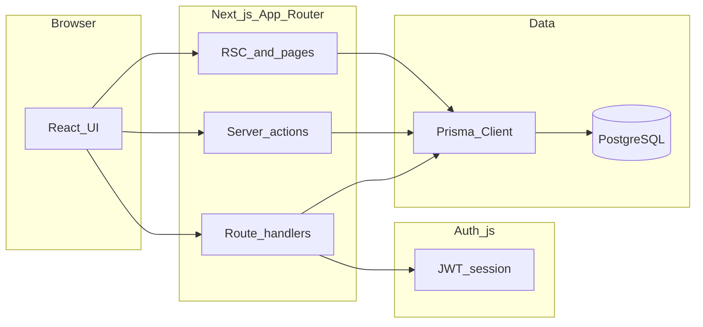

# Architecture

High-level view of how the application is structured. File paths are relative to the repository root.

## Stack

- **Next.js** serves UI (React 19), server components, server actions, and API routes.
- **Prisma** is the only supported database access layer for application code; the database is **PostgreSQL**.
- **Auth.js** issues **JWT** sessions for signed-in users (credentials provider). Session data is also exposed to the client via `/api/auth/session` and [`contexts/AuthContext.tsx`](../contexts/AuthContext.tsx).

## App Router layout

| Area | Typical routes | Notes |
| --- | --- | --- |
| Public | `/login`, `/forbidden` | No authenticated shell |
| Authenticated app | Everything under `app/(app)/` | Wrapped by [`app/(app)/layout.tsx`](../app/%28app%29/layout.tsx): sidebar, branding, working-period context; **`dynamic = "force-dynamic"`** and **`runtime = "nodejs"`** |

The root [`app/page.tsx`](../app/page.tsx) may redirect; most work happens inside `(app)` after login.

## Authentication

- **Credentials** sign-in is implemented in [`auth.ts`](../auth.ts) (`authorize` loads the user from Prisma, verifies password).
- **JWT + session callbacks** live in [`auth.config.ts`](../auth.config.ts) (edge-safe config is merged there; DB access stays in `auth.ts`).
- **Server-side session** for RSC and server actions: [`lib/auth-server.ts`](../lib/auth-server.ts) (wraps `auth()`).
- **Client-side session** mirror: [`contexts/AuthContext.tsx`](../contexts/AuthContext.tsx) fetches `/api/auth/session`.

Profile fields such as **sales point** and optional **service** are embedded in the JWT at sign-in; changing them in the database takes effect on the **next** sign-in unless you add live refresh logic later.

## Authorization

- Route access is enforced with **permission keys** such as `route:/users`, checked against the signed-in user’s role configuration.
- Implementation: [`lib/access-control.ts`](../lib/access-control.ts) (and related helpers). Administrators configure mappings under **Setup → Access control** (`/setup/permissions`).

## Domain areas (by navigation)

These mirror [`app/(app)/layout.tsx`](../app/%28app%29/layout.tsx) sidebar groups—use the path prefixes when searching the codebase.

**Dashboard**

- `/dashboard`

**Setup**

- `/setup`, `/setup/sales-budget`, `/setup/product-pricing`, `/setup/bpo-variants`, `/setup/permissions`
- `/users`, `/customers`, `/financial-years`, `/sales-points`, `/storage-locations`
- `/tax-regimes`, `/tax-types`, `/product-categories`, `/products`

**Operations**

- `/delivery-orders`, `/consignment-notes`, `/pos`
- `/stock/receive`, `/stock/bpo-receive`, `/stock/bpo-consignments`, `/stock/bpo-outbound`

**Reports** (`/reports/...`)

- Sales register, daily summary, delivery orders, monitors, commitments, stock, budget phasing, pricing, BPO monitors and crosstabs—see `reportNav` in the layout file for the canonical list.

## Related documentation

- [configuration.md](configuration.md) — environment variables and settings stored in the database.
